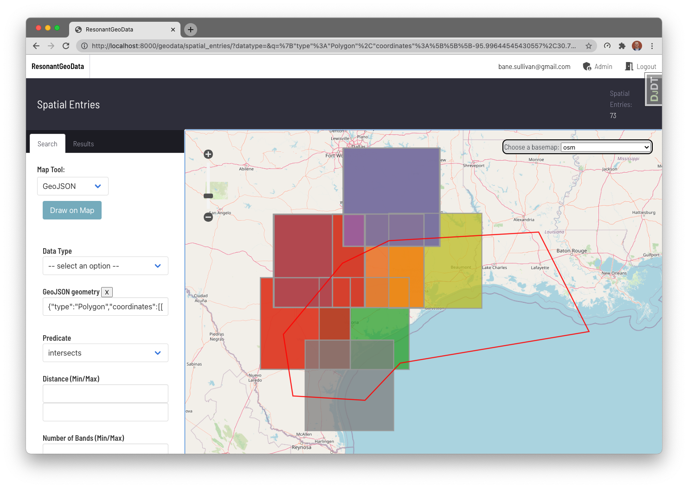

# ResonantGeoData

2D/3D/4D Geospatial Data API in Django

A publicly deployed instance of this application is available at https://www.resonantgeodata.com - find the project code for this at [ResonantGeoData/RD-OpenGeo](https://github.com/ResonantGeoData/RD-OpenGeo)

ResonantGeoData is a Django application well suited for catalogging and searching annotated geospatial imagery, shapefiles, and full motion video datasets.

## Highlights

- Faceted searching of geospatial/temporal data
- Support for the spatial context of Full Motion Video (FMV) datasets
- Support for annotated imagery: polygons, bounding boxes, keypoints, and run-length-encoded masks

## Documentation

Documentation is currently a work in progress. We have created some initial usage instructions under the `docs/` directory.

Specifically, we have included [instructions on how to ingest data](https://github.com/ResonantGeoData/ResonantGeoData/blob/master/docs/ingest-data.md) into a deployed ResonantGeoData instance.

For general questions about the project, its applications, or about software usage, please create an issue directly in this repository. You are also welcome to send us an email at [rgd@kitware.com](mailto:rgd@kitware.com) with the subject line including ResonantGeoData.

## Connections

- ResonantGeoData is built on top of [Kitware's Girder 4 platform](https://github.com/search?q=topic%3Agirder-4+org%3Agirder+fork%3Atrue).
- [KWIVER](https://github.com/Kitware/kwiver): we leverage KWIVER's full motion video processing capabilities to extract spatial information from FMV files.
- [KWCOCO](https://gitlab.kitware.com/computer-vision/kwcoco): KWCOCO is an extension of the [COCO image annotation format](https://cocodataset.org/) which we support for ingesting annotated imagery.
- [GeoJS](https://opengeoscience.github.io/geojs/): we leverage GeoJS for our interactive map view.
- [`large_image`](http://girder.github.io/large_image/index.html): we leverage `large_image` to serve image tiles and extract thumbnails.

## Contributing

Please see the adjacent [`DEVELOPMENT.md`](https://github.com/ResonantGeoData/ResonantGeoData/blob/master/DEVELOPMENT.md) file for all development instructions.
