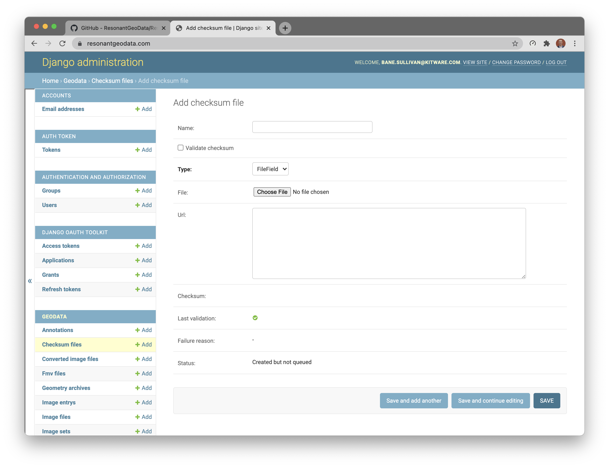
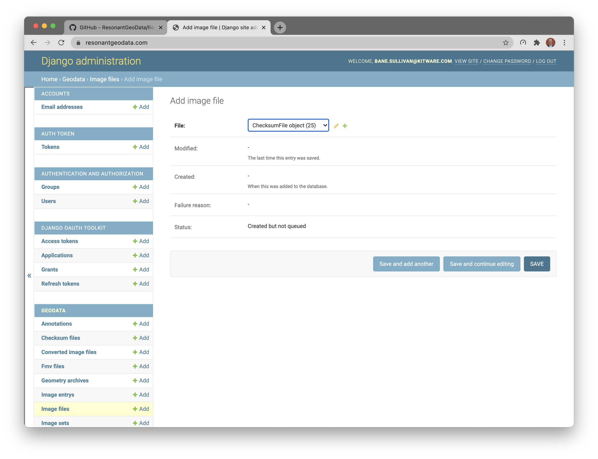
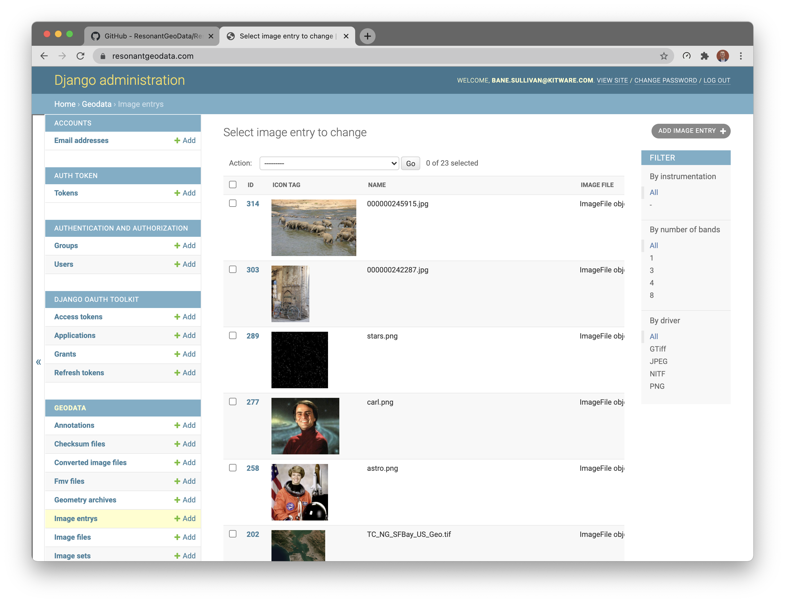
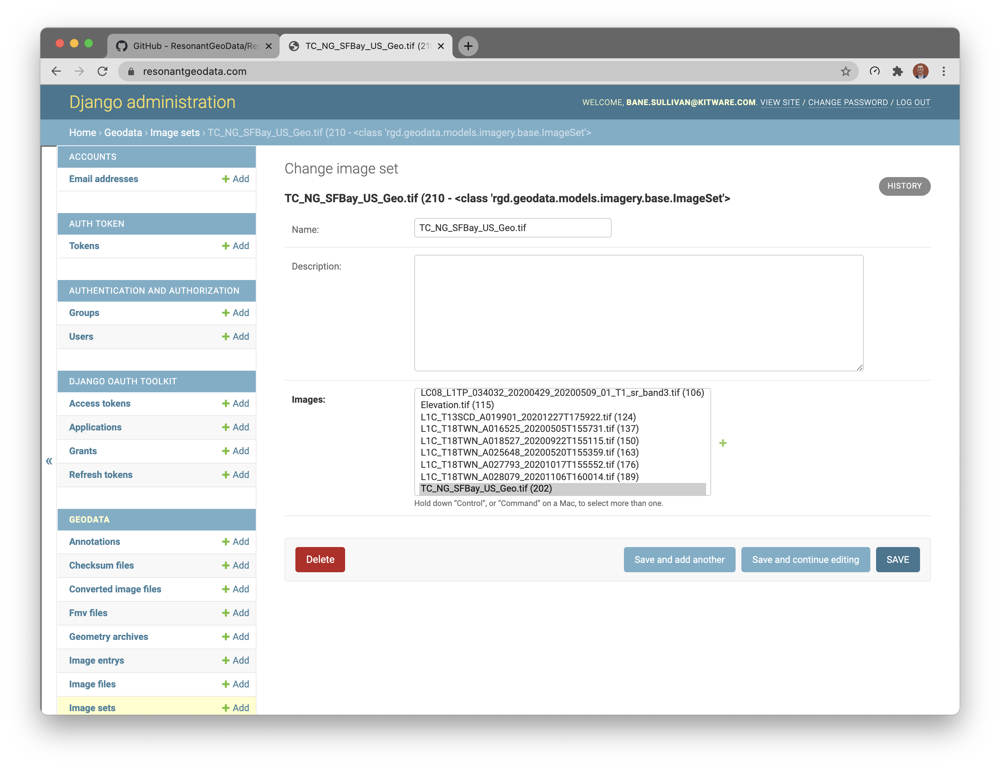
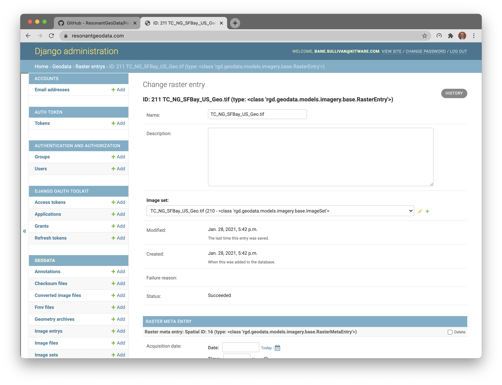
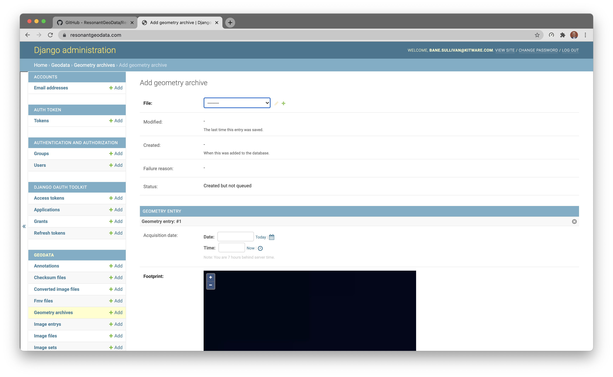
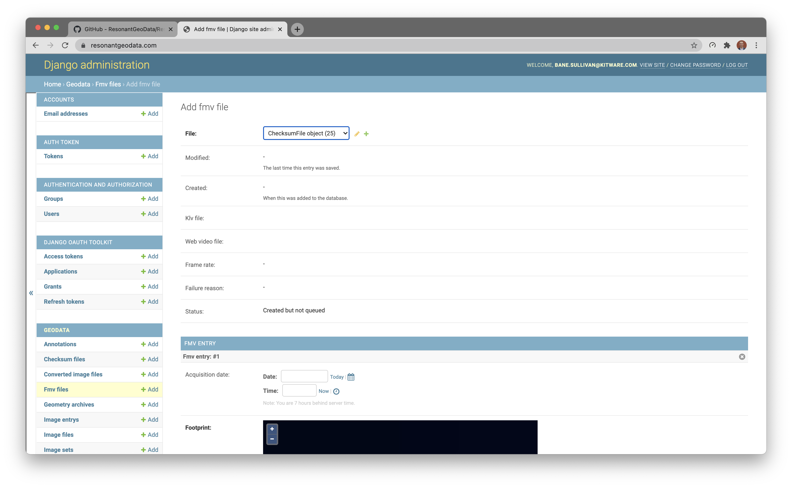

# How to Ingest Data

## Imagery: `ImageEntry` and `RasterEntry`

All new images added to the catalog, spatial or not, must be added as a new
`ImageFile` entry which links to the base `ChecksumFile` model.

To create a new `ImageEntry`, first upload your single image file into a new `ChecksumFile` instance:

Then simply create a new `ImageFile` entry that links to the previously created `ChecksumFile`.

This step lets the data catalog know that the added file is an image, and it will begin a few processing routines in the background to create an `ImageEntry` automatically. Once saved, you can go to the "image entrys" section of the admin portal, and you will find your image listed there:

There you can view all of the extracted metadata for that image:

### Addition Steps for Rasters

If you want to register one or more of your uploaded images as a geospatial raster, then you will need first to create an `ImageSet` of the images in the given raster:

Once you have an `ImageSet`, we need to register that set with the `RasterEntry` model. Create a new `RasterEntry` and only populate the first section of fields: name, description, and image set. Then hit save, and the linked `RasterMetaEntry` will be automatically populated.

After this, the raster is registered with the data catalog, and it will appear on the front-end when performing searches.

## Geometry: `GeometryEntry`

Creating a new `GeometryEntry` is very similar to the previous process of creating a new `ImageEntry`. To do so, first, upload a `.zip` archive of the shapefile and its auxiliary files to a new `ChecksumFile` entry. Then link that `ChecksumFile` to a new `GeometryArchie` entry:

This will then auto populate the linked `GeometryEntry`, and the dataset will immediately be available in the catalog.

## Full Motion Video: `FMVEntry`

Creating a new `FMVEntry` is very similar to the previous processes. To do so, first, upload the FMV file to a new `ChecksumFile` entry. Then link that `ChecksumFile` to a new `FMVFile` entry:

This will then auto populate the various disabled fields in the `FMVFile` model with temp files for extracting the spatial data and a web-friendly version of the video. This will also automatically fill out the linked `FMVEntry`, and the dataset will soon be available in the catalog. The processing routine for these files can take a while to run to completion.
